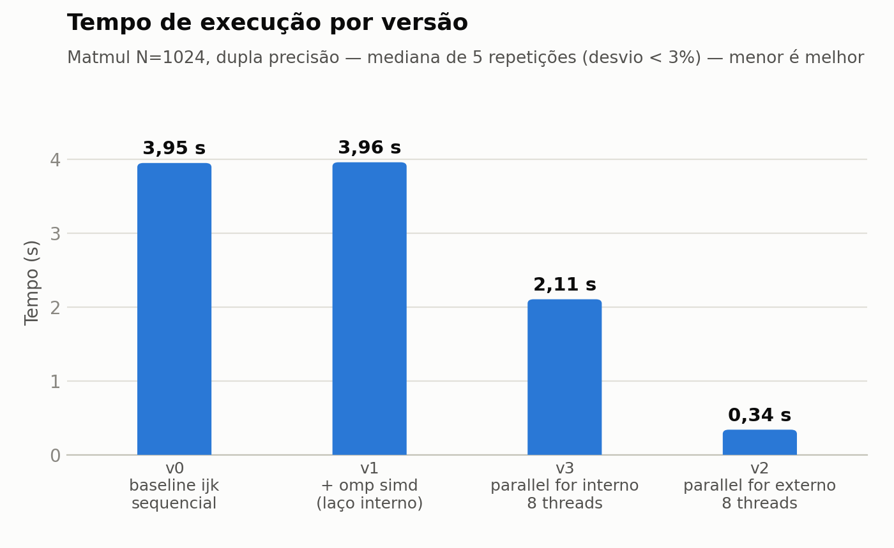
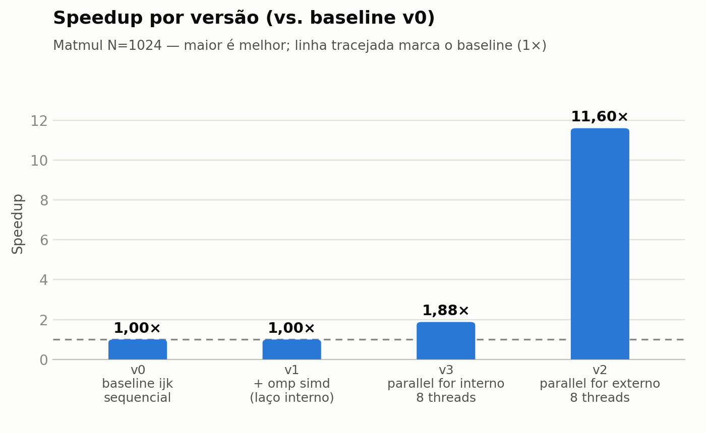
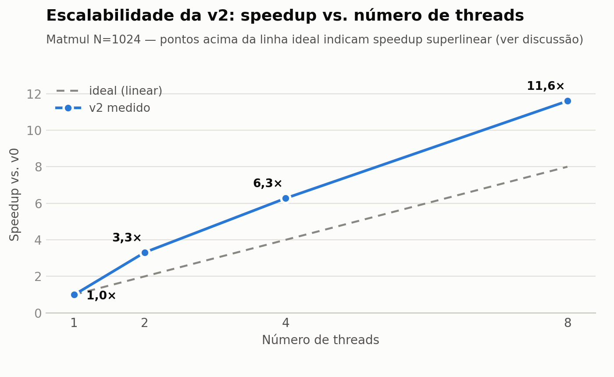
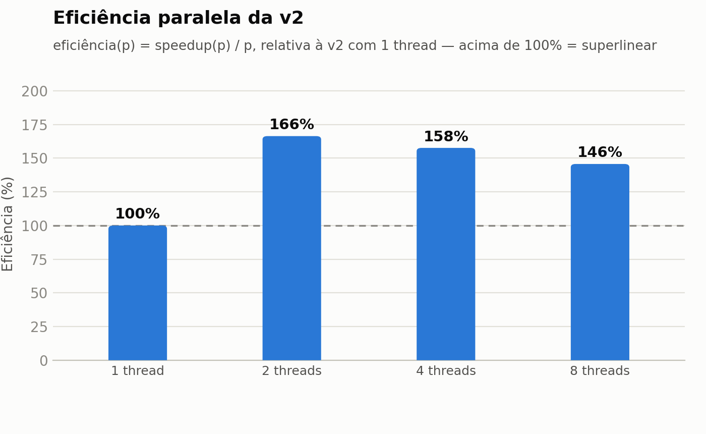

# Trabalho Final — Software de Alto Desempenho (INF01094)

**Otimização de multiplicação de matrizes densas em CPU com OpenMP: uma investigação sobre vetorização, granularidade de paralelismo e escalabilidade**

---

## 1. Problema e aplicação

O problema escolhido é a **multiplicação de matrizes densas** `C = A × B`, com elementos em dupla precisão (`double`) e tamanho principal **N = 1024** (três matrizes de 8 MiB; 24 MiB no total; 2·N³ ≈ 2,15 GFLOP por execução). A multiplicação de matrizes é o núcleo computacional de aplicações de álgebra linear, simulação e aprendizado de máquina, e é um caso clássico de kernel com **reuso de dados** e **paralelismo abundante** — cada elemento de `C` pode ser calculado de forma independente.

O objetivo da investigação **não** é competir com bibliotecas BLAS, e sim usar o kernel como laboratório para responder a uma pergunta prática: *dado um código sequencial com gargalo conhecido, quais intervenções OpenMP produzem ganho real, quais não produzem, e por quê?*

**Ambiente:** AMD Ryzen 7 7800X3D (8 cores / 8 threads, sem SMT; L1d 8×32 KiB, L2 8×1 MiB, L3 96 MiB compartilhada, AVX-512), Linux 6.17, gcc 15.2.0. Todas as versões compiladas com `-O3 -march=native -fopenmp`.

## 2. Baseline

A versão **v0** é a implementação canônica com laços `i-j-k` e acumulador local:

```c
for (int i = 0; i < n; i++)
    for (int j = 0; j < n; j++) {
        double sum = 0.0;
        for (int k = 0; k < n; k++)
            sum += A[i*n + k] * B[k*n + j];
        C[i*n + j] = sum;
    }
```

### Metodologia de medição

- **1 execução de warm-up não medida** (toca as páginas de memória e aquece as caches), seguida de **5 repetições medidas** com `omp_get_wtime()`; reporta-se a **mediana** e o desvio-padrão (< 3 % em todas as configurações).
- Threads fixadas nos cores físicos com `OMP_PROC_BIND=close` e `OMP_PLACES=cores`.
- O governor de frequência da máquina é `powersave`. Para descartar interferência de DVFS, a frequência foi **amostrada continuamente** durante as execuções: o core solo sustenta ~4,96 GHz (média de 52 amostras; mín. 3,50, máx. 5,04) e as execuções com 8 threads sustentam ~4,8 GHz all-core (ver `results/controles.txt`).
- Matrizes inicializadas com gerador determinístico (LCG com semente fixa): todas as versões operam sobre exatamente os mesmos dados.

**Baseline medido: 3,952 s (mediana de 5 repetições, σ = 0,004 s) → 0,543 GFLOP/s.**

### Validação de corretude

Cada versão otimizada é comparada elemento a elemento com o resultado da v0 sobre as mesmas entradas (`./matmul --check`). As três versões produziram **diferença máxima absoluta e relativa igual a zero** em N = 1024 (`results/validacao.txt`).

## 3. Diagnóstico do gargalo

Um núcleo Zen 4 a ~4,9 GHz executando FMA vetorial tem pico teórico de ~76,8 GFLOP/s (o chip inteiro, ~614 GFLOP/s). A v0 atinge **0,543 GFLOP/s — menos de 1 % do pico de um único core** — logo o gargalo não é capacidade de cômputo.

O laço interno percorre `B[k*n + j]` com **stride de N elementos (8 KiB)**: cada iteração toca uma linha de cache diferente, de uma região de 8 MiB que não cabe na L2 (1 MiB). A latência de acesso domina o tempo (≈ 18 ciclos por iteração a 4,96 GHz), caracterizando um kernel **memory-latency-bound** por padrão de acesso — o sintoma "tempo dominado por memória / acessos com stride" do mapa de decisão da disciplina. Duas hipóteses de intervenção foram formuladas:

- **H1 (falsa):** o laço interno é um produto escalar; pedir vetorização explícita (`omp simd`) aproveitaria as unidades AVX-512 e reduziria o tempo.
- **H2 (verdadeira):** o laço externo tem 1024 iterações independentes; distribuí-las entre os 8 cores com granularidade grossa multiplica o throughput agregado de acesso à memória e o cômputo.

## 4. Otimizações

### v1 — `omp simd` no laço interno (a otimização sem ganho)

```c
double sum = 0.0;
#pragma omp simd reduction(+:sum)
for (int k = 0; k < n; k++)
    sum += A[i*n + k] * B[k*n + j];
```

*Hipótese:* vetorizar o produto escalar (8 doubles por instrução AVX-512) daria ganho próximo de 8× na parte aritmética.

*Implementação e verificação:* o compilador confirma a vetorização (`-fopt-info-vec`: “loop vectorized using 64 byte vectors”), mas a inspeção do binário (`objdump`) mostra **zero instruções gather** — como `B` é acessada com stride, os vetores são montados com cargas escalares individuais. O número de linhas de cache trazidas por iteração **não muda**.

### v2 — `omp parallel for` no laço externo (o benefício comprovado)

```c
#pragma omp parallel for schedule(static)
for (int i = 0; i < n; i++)
    ...  /* corpo idêntico ao da v0 */
```

*Hipótese:* granularidade grossa — uma única região paralela; cada thread recebe N/p linhas de `C` (trabalho de ~N³/p operações) sem nenhuma sincronização interna. O corpo do laço é **idêntico ao da v0**, isolando o efeito da paralelização (confirmado: v2 com 1 thread = 3,972 s ≈ v0).

### v3 — experimento de granularidade: `omp parallel for` no laço interno

```c
#pragma omp parallel for reduction(+:sum) schedule(static)
for (int k = 0; k < n; k++) ...
```

Versão de controle para quantificar o custo da granularidade errada: a região paralela é criada **N² ≈ 1 milhão de vezes**, cada uma distribuindo apenas 1024 multiplicações e terminando em reduction + barreira.

## 5. Resultados

| Versão | Configuração | Tempo (mediana ± σ) | Speedup vs. v0 | GFLOP/s | Eficiência |
|---|---|---|---|---|---|
| v0 | sequencial | 3,952 s ± 0,004 | 1,00× | 0,543 | — |
| v1 | `omp simd`, sequencial | 3,962 s ± 0,005 | **1,00×** | 0,542 | — |
| v3 | paralelo interno, 8 threads | 2,107 s ± 0,054 | 1,88× | 1,019 | 23 % |
| v2 | paralelo externo, 1 thread | 3,972 s ± 0,010 | 1,00× | 0,541 | 100 % |
| v2 | paralelo externo, 2 threads | 1,194 s ± 0,008 | 3,31× | 1,799 | 166 % |
| v2 | paralelo externo, 4 threads | 0,630 s ± 0,003 | 6,27× | 3,409 | 158 % |
| v2 | paralelo externo, 8 threads | **0,341 s ± 0,014** | **11,60×** | 6,302 | 146 % |

(Eficiência paralela = speedup(p)/p; para a v2, relativa à v2 com 1 thread.)









## 6. Discussão

**Por que a v1 não melhorou.** A hipótese H1 falhou porque tratou o kernel como compute-bound. A vetorização aconteceu de fato (vetores de 64 bytes confirmados pelo compilador), mas SIMD só multiplica a taxa de *cômputo* — e o tempo da v0 é gasto esperando linhas de cache do acesso com stride a `B`. Montar o vetor com 8 cargas escalares custa o mesmo tráfego de memória que o código escalar, e o resultado é 0,997× (empate estatístico). É o caso previsto no material da disciplina: *uma técnica conhecida só é uma boa otimização quando resolve o gargalo dominante* — aqui, o gargalo é o padrão de acesso, não a falta de instruções vetoriais.

**Por que a v3 ficou no meio do caminho.** Paralelizar o laço errado rendeu 1,88× com 8 cores — ganho positivo, porém com **eficiência de 23 %**: 77 % da capacidade contratada é desperdiçada criando ~1 milhão de regiões paralelas, cada uma com reduction e barreira. O ganho só não é pior porque a libgomp usa espera ativa (busy-wait), que barateia o fork/join, e porque 8 threads acessando `B` em paralelo escondem parte da latência de memória. O resultado confirma a lição da Família 7: *o overhead de paralelizar pode ser da ordem do ganho* quando a granularidade é fina — mesmo quando não chega a piorar o tempo, destrói a eficiência.

**Por que a v2 escala — e o speedup superlinear.** Com granularidade grossa, o escalonamento incremental é quase linear (2→4 threads: 95 %; 4→8: 93 %), e 8 threads entregam 11,60×. Speedup acima de p (eficiência > 100 %) é anômalo, e foi investigado com três experimentos de controle (`results/controles.txt`):

1. **Não é DVFS:** a frequência sustentada do core solo (~4,96 GHz) é *maior* que a all-core (~4,8 GHz); o efeito vai na direção contrária.
2. **Não é code-gen:** v2 com 1 thread empata com a v0 (3,972 s vs. 3,952 s) — o corpo compilado é equivalente.
3. **Não é co-execução em si:** dois *processos* v0 independentes, com matrizes privadas, rodando simultaneamente em cores distintos mantêm ~3,9 s cada — o throughput por core não muda quando os dados **não** são compartilhados.

A explicação restante — consistente com os três controles, embora sua confirmação definitiva exigisse contadores de hardware (indisponíveis sem root nesta máquina, `perf_event_paranoid=4`) — é o **reuso da matriz compartilhada `B` através da hierarquia de cache**: na v2 todas as threads percorrem as mesmas colunas de `B` aproximadamente em fase, e o custo de trazer cada linha de cache de `B` para perto dos cores (L3 victim cache do Zen 4, 96 MiB) é pago uma vez e aproveitado por todas — enquanto a thread única da v0 paga esse custo sozinha, iteração após iteração. O throughput *por core* sobe de ~18 para ~11–12 ciclos por iteração assim que há 2 ou mais threads cooperando sobre a mesma `B`.

**Limitações.** (i) Sem acesso a `perf`/RAPL, o diagnóstico fino (misses por nível de cache, IPC, energia/EDP) não pôde ser medido — as conclusões microarquiteturais acima estão explicitamente marcadas como hipótese controlada por experimentos. (ii) Mesmo a v2 usa ~1 % do pico do chip: o próximo gargalo continua sendo o stride sobre `B`; troca de laços (ikj), tiling para cache e vetorização com acesso unitário seriam os próximos passos naturais e devem compor com o paralelismo da v2. (iii) Resultados obtidos com governor `powersave`; a frequência foi monitorada, mas um governor `performance` reduziria ainda mais a variância.

## 7. Conclusão

A melhor configuração encontrada é a **v2 — `omp parallel for schedule(static)` no laço externo, com 8 threads fixadas nos cores físicos: 0,341 s, speedup de 11,60× sobre o baseline** (3,952 s), com corretude bit a bit idêntica à referência.

O principal aprendizado técnico: **o valor de uma técnica depende do gargalo, não da técnica.** Sobre o mesmo kernel, o mesmo padrão OpenMP produziu 1,00× (`simd` que não altera o tráfego de memória), 1,88× com 23 % de eficiência (paralelismo com granularidade fina) e 11,60× (paralelismo com granularidade grossa) — e o ganho superlinear da versão correta só se explica olhando para a interação entre compartilhamento de dados e hierarquia de cache, não para a contagem de threads. Medir, diagnosticar e controlar as variáveis (warm-up, pinning, frequência, validação de corretude) foi o que permitiu distinguir os três desfechos e explicá-los.

---

### Reprodução

```bash
make            # compila
make check      # valida corretude das 3 versões contra a v0
make bench      # roda todas as medições -> results/raw.csv
make plots      # gera os gráficos -> results/*.png
```
